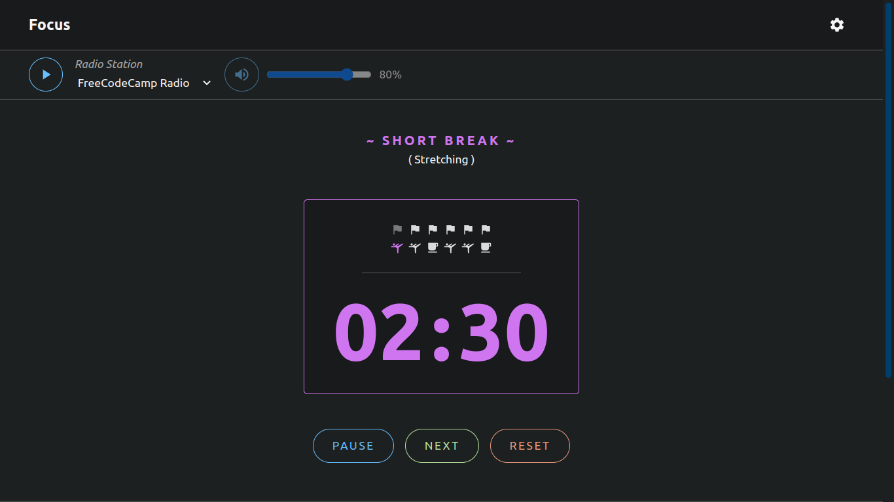

# Focus

### Timer with focus on breaks.

Due to the use of service workers, the time counter should be pretty accurate, regardless of whether the browser tab is focused or not.

Desktop notifications, alarms on finished rounds and listening to radio, all is deasabled by default but can be easily switched on.

